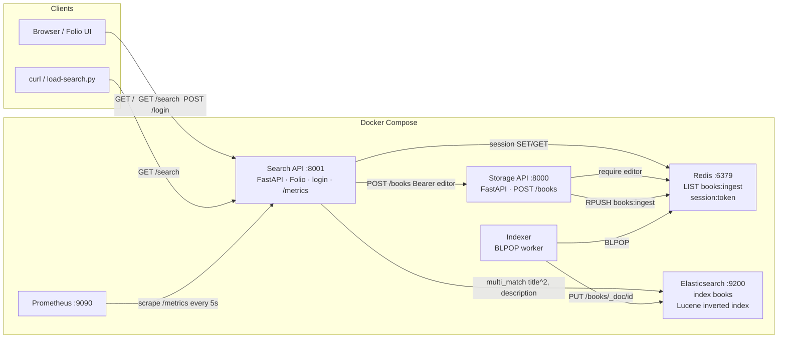
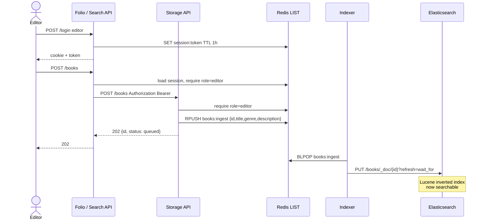
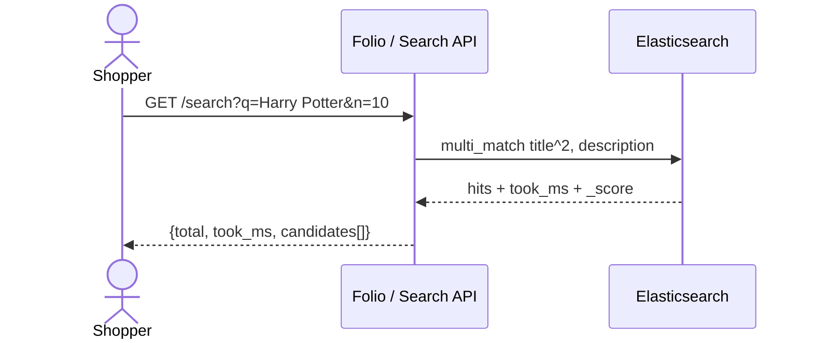
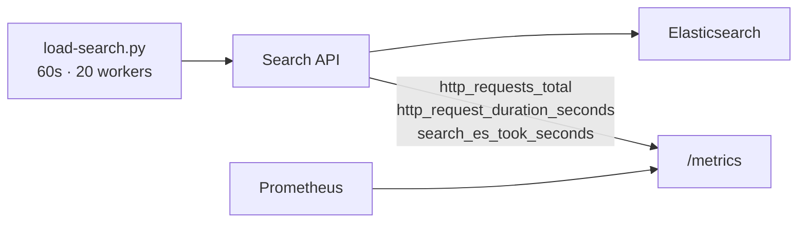

# System design — Folio e-books

Laptop topology. Everything runs in Docker Compose on one MacBook (16GB). This is the v1 we demo, not a multi-region production cluster.

---

## Container view

**Read path is sync. Write path is async.** Clients never talk to Elasticsearch or Redis.

| Service | Port | Role |
|---|---|---|
| Folio + Search API | 8001 | Public search, login, editor proxy to Storage API, `/metrics` |
| Storage API | 8000 | Authenticated ingest only (`editor` role) |
| Redis | 6379 | Ingest queue (`books:ingest`) + sessions |
| Indexer | — | Competing consumer; writes Lucene/ES |
| Elasticsearch | 9200 | Single-node inverted index (`books`) |
| Prometheus | 9090 | Scrapes Search API |

Users are seeded in Search API memory (`editor`, `shopper`). Sessions live in Redis so they survive API restarts.

---

## Ingest sequence

Editor adds a book. Search API is a BFF for the browser; Storage API is the source of write truth.

Shopper sessions get **403**. No token gets **401**.

---

## Search sequence

Anyone can search. Default `n=10` (max 50). Results are the top-n BM25 scores.

Seed catalog (`data/books.json`) is 7 Harry Potter novels plus 15 others, fed through the ingest path (`./scripts/seed-books.sh`).

---

## Observe and load

Baseline we measured: **~169 rps**, p95 **296 ms**, **0 errors**. Not saturated yet. Raise `CONCURRENCY` until p95 or 5xxs break — that is the saturation point.

Likely bottleneck on this laptop: ES heap (512MB inside a 1GB container), not Search API RAM.

---

## What this is not (yet)

- Kubernetes / HPA (Compose is the 90-minute choice)
- Postgres users (in-memory users + Redis sessions)
- Kafka (Redis LIST competing consumers instead)
- Fuzzy typo search, daily full reindex job, Grafana, traces

Those are the “if we had more time” items. Daily full reindex would rebuild `books` from a catalog extract like `data/books.json`.
